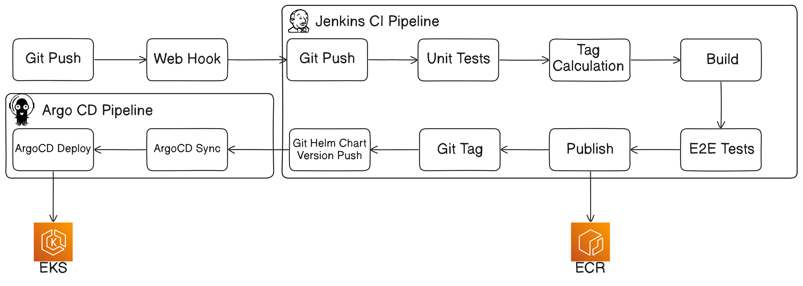

# Flask Video API

## Overview

This Flask application provides a RESTful API for managing video resources, integrated with Prometheus for metrics collection and MongoDB for data storage. It supports CRUD operations for video records and includes a basic health check endpoint.

## Features

- **Jenkins CI Pipeline + ArgoCD Depoyment**:

- **Jenkins Architecture**:

- **RESTful API Endpoints**:
  - `GET /api/v1/videos`: Retrieve a list of all videos.
  - `GET /api/v1/videos/<video_id>`: Retrieve a specific video by ID.
  - `POST /api/v1/videos`: Create a new video record.
  - `PUT /api/v1/videos/<video_id>`: Update an existing video record.
  - `DELETE /api/v1/videos/<video_id>`: Delete a video record.
  - `GET /healthcheck`: Health check endpoint to verify if the service is running.
  - `GET /metrics`: Expose Prometheus metrics for monitoring.

## Prerequisites:
  * A Kubernetes cluster with ArgoCD installed. [Solution here](https://github.com/LevinsonEli/eks-terraform).
  * Infrastructure deployed to Kubernetes. [Solution here](https://github.com/LevinsonEli/k8s-infra-apps).
  * The Videos Helm project added to ArgoCD. [Solution here](https://github.com/LevinsonEli/helm-videos-app).
  * A Jenkins machine set up for CI/CD.
